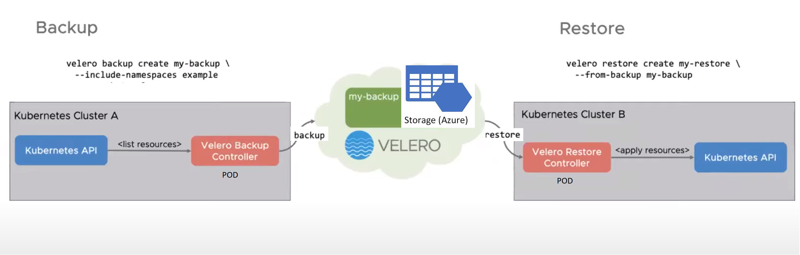

## Overview

This repository contains these plugins to support running Velero on Microsoft Azure:

- An object store plugin for persisting and retrieving backups on Azure Blob Storage. Content of backup is log files, warning/error files, restore logs.

- A volume snapshotter plugin for creating snapshots from volumes (during a backup) and volumes from snapshots (during a restore) on Azure Managed Disks.
  - Since v1.4.0 the snapshotter plugin can handle the volumes provisioned by CSI driver `disk.csi.azure.com`

## Velero Features

- Backup & Restore of Kubernetes objects (Cluster configuration)
- Backup & Restore of persistent volumes


## How Velero works (High Level Architecture)




## See it in action (it takes 5 minutes) !

The sample code provides a Terraform module to install & confiugre Velero.
The sample scenario show how to backup a primary AKS Cluster and restore it to a backup / secondary cluster, in a secondary Region:


**In the Primary Region (WestEurope in the sample)**
- Creates a source AKS cluster named **example-aks1**, configured with Availability zones
- Installs and configures Velero in source cluster **example-aks1** (Velero referencing backup location in secondary Region)

**In the Secondary / Backup Region (NorthEurope)**
- Creates a Backup AKS cluster (to restore cluster **example-aks1-dr**), configured with Availability zones
- Creates a storage location (Azure Storage Account) to store backups 
- Installs and configures Velero in backup cluster **example-aks1-dr** (Velero referencing the same backup location in secondary Region)


**Steps to deploy!**

* Connect to your Azure Cloud Shell on the Portal:


* Clone the AKS Accelerator repository: 
```bash
git clone https://github.com/Azure/AKS-Landing-Zone-Accelerator.git
```

* Go to the BAckup & Restore directory:
```bash
cd Scenarios/backup_restore/velero_terraform_sample
```

* Create the Service Principal, representing Velero, to perform backups & restores:

```bash
az ad sp create-for-rbac --name sp-velero-aks1 --role Reader
```

* Deploy the Terraform sample code:

```bash
terraform init
terraform plan
terraform apply
```

* Check that the install is successfull: 
  - First install Velero client (CLI) to interact with Velero Server (Pod deployed on AKS cluster): https://velero.io/docs/v1.7/basic-install/#install-the-cli

  - Connect to the Primary AKS Cluster (following the sample code as is): 
  ```bash
  az aks get-credentials --name example-aks1 --overwrite-existing --resource-group testvelero
  ```
  - You should see a first backup performed upon deployment using the sample code:
  ```bash
  velero backup get
  ```
  
  
  

* Deploy sample statefull applications:

 ```bash
  cd application_samples
  kubectl apply -f ./
  ```

* Create a backup for primary AKS cluster:

 ```bash
velero backup create manual-backup1 --default-volumes-to-restic -w
  ```


* Restore to secondary AKS cluster:
  - Connect to the Secondary / Backup AKS Cluster (following the sample code as is): 
  ```bash
  az aks get-credentials --name aks-dr --overwrite-existing --resource-group aks-dr
  ```

  - As Velero is configured, in the secondary backup cluster, to reference the same backup location (storage account container), You should see the same backups available :
  ```bash
  velero backup get
  ```
  
  
  - Restore from backup :
  ```bash
  velero restore create restore1 --from-backup manual-backup1 -w
  ```
 

* Check that Restore is successfull:
  - Check restored applications / pods
  ```bash
  kubectl get pods --all-namespaces
  ```
  - check restore details 
  ```bash
  velero restore get restore1
  ```
   ```bash
  velero restore describe restore1 --details
  ```


### Next steps

:arrow_forward: [Plan your AKS Backup & Restore for Disaster Recovery](./Scenarios/Secure-Baseline)

:arrow_forward: [Deep Dive on Velero configuration for AKS](./Scenarios/AKS-Secure-Baseline-PrivateCluster)

## A future workload for this scenario will include the following 
* Deploy Velero as part of the AKS-Secure-Baseline-PrivateCluster

