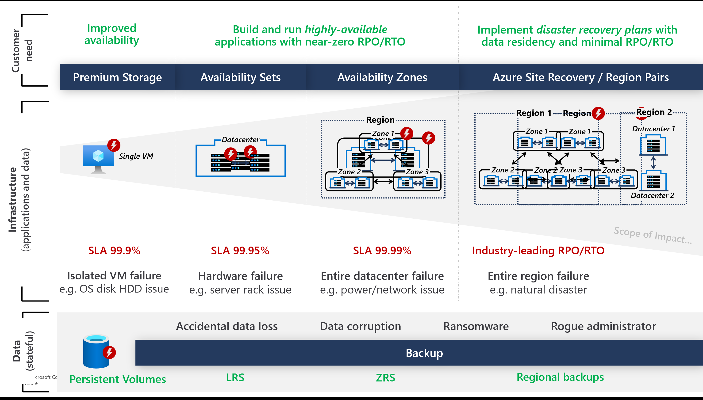

## Architecting for High Availability & Resiliency

## High Availability Considerations
Cluster Infrastructure:
* Enable Uptime SLA for production workloads
* Use Availability Zones
* Use multiple node pools & nodes spanning AZs
* Configure Taints & Tolerations , Pod Affinity
* Use Toplogy Aware scheduling (optimally route traffic within the same zone to avoid latency)
* Use Virtual Nodes to quicly span new containers

* TODO: example / best practice for Taints & Tolerations using AZs

for storage sources (Storage Class Configuration)
* Use Azure Disk with ZRS (currently in Preview) --> available via Azure Disk CSI Driver
* Use Azure File with ZRS

## Disaster Recovey Considerations

Prepare Identities

Cluster Deployment

Node Pool Configuration
** Create Nodes & re-deploy Node Configuration
** Use Node Configuration Snapshot (currently in Preview)

For a **Stateless** Application: 
*Redeploy Application Configuration 

For a **statefull** Application, you need to backup & Restore:
** Persistent Volumes (Azure Disk & Azure Fileshare)
** Cluster configuration (technical pods)
** Application Configuration (linked with the restored persistent volumes)
